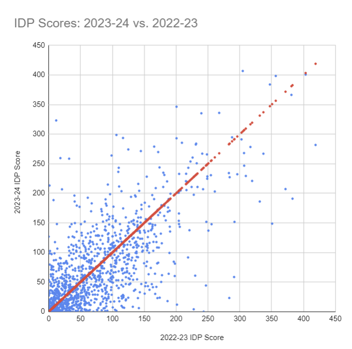
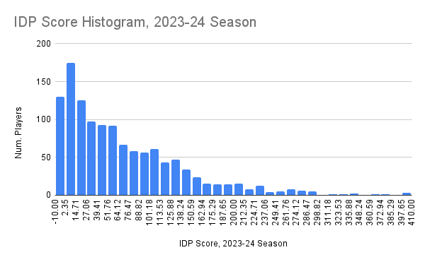
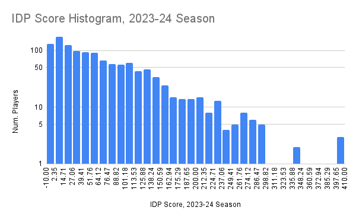
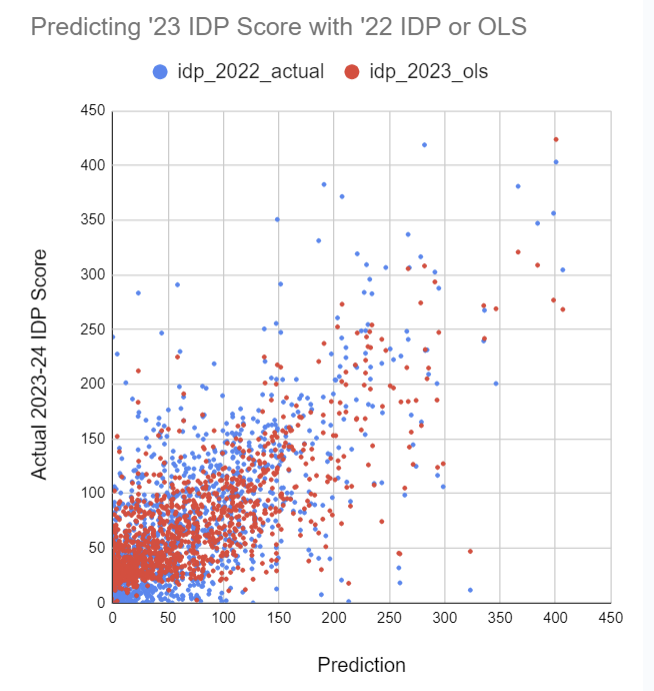
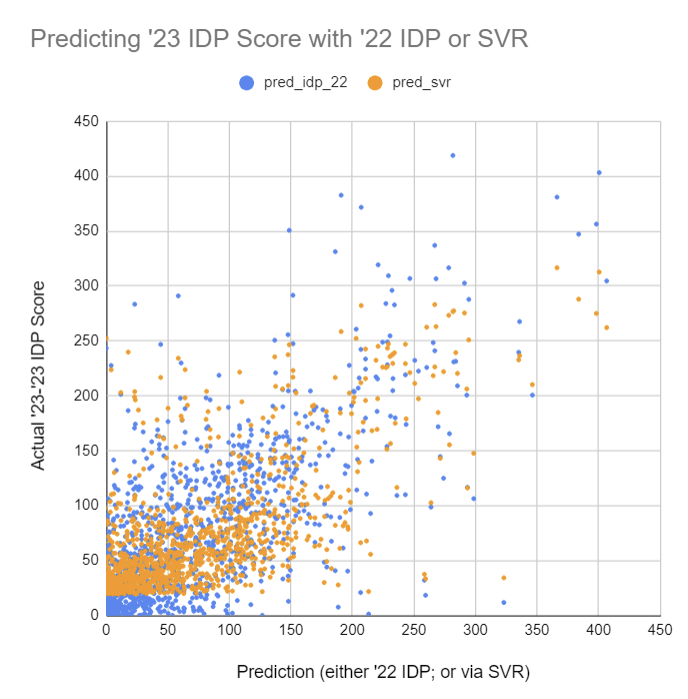

# LombardoTron

I got a fantasy football draft coming up Monday Aug 26, 2024, and I need a way
to rank players.  So I will try out some models in SciKit-Learn that map
year K's stats to year K+1's overall performance.

It's an IDP league, so I gotta pay attention to offense and defense.  Which,
look, this is all the same to me, I'm outsourcing all this to some random
forest anyway.

## Python environment

Here are the actual pip commands I have run in this project's virtual
environment:

```shell
$ pip3 install -U scikit-learn
```

Results:

```shell
$ pip freeze
joblib==1.4.2
numpy==2.1.0
scikit-learn==1.5.1
scipy==1.14.1
threadpoolctl==3.5.0
```

## Data

Much thanks to NFLVerse for these CSVs:

*  https://github.com/nflverse/nflverse-data/releases/tag/player_stats
*  https://github.com/nflverse/nflverse-data/releases/tag/weekly_rosters

I downloaded a few into a folder called `data/` that I told git to ignore.

The column translations are available at:

https://nflreadr.nflverse.com/articles/dictionary_player_stats.html

### Team Changes

How often do players change teams in a regular+post season? Some guys see as
many as five different teams:

```
Mike Evans (00-0031408): 5
Tyreek Hill (00-0033040): 5
JuJu Smith-Schuster (00-0033857): 5
Courtland Sutton (00-0034348): 5
Devin Singletary (00-0035250): 5
Michael Pittman (00-0036252): 5
Ja'Marr Chase (00-0036900): 5
Peyton Hendershot (00-0037569): 5
Tyler Lockett (00-0032211): 4
Demarcus Robinson (00-0032775): 4
George Kittle (00-0033288): 4
Samaje Perine (00-0033526): 4
Austin Ekeler (00-0033699): 4
Evan Engram (00-0033881): 4
River Cracraft (00-0034054): 4
Alec Ingold (00-0035125): 4
Terry McLaurin (00-0035659): 4
Marquise Brown (00-0035662): 4
Brandon Aiyuk (00-0036261): 4
Chase Claypool (00-0036326): 4

Num Teams: Num Players
1: 1359
2: 206
3: 61
4: 17
5: 8
```

About one in six players get traded at least once. So not a totally ignorable
corner case.

[Commit with this code: 3cfbe72](https://github.com/bgawalt/lombardotron/blob/3cfbe7256c98c3e22598538eb114b79a2862df5f/lombardotron.py)

### Rookies and Retirement

How many players are in both seasons? Either season? Just '22 or just '23?

```
'22: 1651
'23: 1614
Both: 1189
Either: 2076
Just '22: 462
Just '23: 425
```

So of the 1614 players in '24 I'm gonna rank for the draft, I should expect
440 of them to be rookies, where I can't guess their quality from their previous
NFL stats.

[Commit with this code: af9dd8c](https://github.com/bgawalt/lombardotron/blob/af9dd8c38c797e504103d775180cc4613190632d/lombardotron.py)

### Fantasy Points

Here's the 10 lowest- and 10 highest-scoring players in the 2022-23 season,
according to my IDP league's scoring system:

```
T.Boyle (00-0034177):   -2.9
M.Dickson (00-0034160): -1.8
C.Beathard (00-0033936):        -1.0
C.Henne (00-0026197):   -0.5
N.Sudfeld (00-0032792): -0.4
J.Gillan (00-0035042):  -0.3
J.Gordon (00-0029664):  0.0
B.Anger (00-0029692):   0.0
D.Bakhtiari (00-0030074):       0.0
T.Gentry (00-0033633):  0.0
...
J.Jacobs (00-0035700):  331.3
D.Adams (00-0031381):   337.0
T.Hill (00-0033040):    347.2
J.Burrow (00-0036442):  350.7
C.McCaffrey (00-0033280):       356.4
J.Jefferson (00-0036322):       371.7
J.Hurts (00-0036389):   381.0
A.Ekeler (00-0033699):  382.7
J.Allen (00-0034857):   403.3
P.Mahomes (00-0033873): 418.9
```

[Commit with this code: 4f85564](https://github.com/bgawalt/lombardotron/blob/4f85564ee9b8755b31f015436ca9e41e2fb3f5d6/lombardotron.py)

We can also look at each player's total IDP points across '22 vs. across '23
(with a series of y = x equality included in red):



**This is the baseline to beat.** I will need to come up with a function of
'22-season stats that is a tighter match to '23 performance, than just applying
the IDP formula to the '22 stats and calling that my prediction.

Here are histograms of season-long player IDP score, with y-axis counts in
linear and log scale, for the 2023-24 season:





[Commit with this code: 1600d74](https://github.com/bgawalt/lombardotron/blob/1600d74f4f316309844f654d4dd0a97ff325bfba/lombardotron.py)

## Building Examples

Machine learning requires labeled examples; `(x; y)` pairs, for feature vectors
`x` and labels `y` (scalar or vector).

### Example unit

Each example is a player who played in both the 2022-23 season *and* the
2023-24 season. That comes to 1,218 players.

### Labels

This is straightforward: the label for a player will be their IDP score,
calculated over the player's total stats accumulated for the full '23 *regular*
season (no post season).

### Season Stat Features

Feature vectors are primarily based on the player's stats from '22, accumulated,
again, across the *regular* season games.

#### Numerical stats

The features I will use for each player are their season-wide stats racked up in
the 2022-23 regular season.

The list of numerical stats I extract from the NFLverse CSVs are in
`statvalues.py`. I wind up with 97 of them overall.  Interestingly, one stats
counts a player's field goals missed from 0 to 19 yards away from the end zone
-- and not a single player ever missed an FG from that close in the '22-'23
season. So that feature is useless.

[Commit with this code: 1104d60](https://github.com/bgawalt/lombardotron/blob/1104d6095c098b4932e42be877890b868cd80b2b/lombardotron.py)

#### Text stats

In addition to the season-aggregate numerical stats, I can encode categorical
features of each player as well:

##### Teams

I can count the number of games played for each team, for each of
the offensive, defensive, and kicking stats CSVs I load. I already track
total number of games played in each role-type as numeric stats `"games"`
(for offense), `"def_games"`, and `"kck_games"`; but now I can further
break that down by team. (Maybe that means I should drop the redundant
numeric sums.)

These features wind up looking like a sparse vector of length (3 * 32) = 96.
Most of the entries are zero: not that many players play for multiple teams in
a season (like one in six are traded, per above?), and not that many rack up
stats across the off.-v-def.-v-kicking divide.

[Commit with this code: 397fc59](https://github.com/bgawalt/lombardotron/blob/397fc59616a89b0214a607927f3356090e84ff78/lombardotron.py)

##### Position

I can also do a sparse, one-hot encoding of each player's position.  There
are 26 total positions, and I can't find an example of a player playing in
multiple across the CSVs. But just in case, the features report total number of
games played in each position.

[Commit with this code: 660a76d](https://github.com/bgawalt/lombardotron/blob/660a76dbf854341eb47ea21743ab68173deaa70d/lombardotron.py)

### Starting Week Features

The NFLVerse CSV collection also includes weekly rosters, which means we can
look up what each player looks like at the start of the season. That seems
pretty handy: predict performance in '23 not just in '22, but with info that
reflects what happened with the player in the offseason.

So there is a `WeeklyRosterPlayer` class for bringing in basic details of what
the player was like at-or-before Week 1 games -- and this info is
currently/already available for 2024. Height, weight, age, etc.: pretty good.
Plus, this handles rookies, whose main body of previous-season-stats are empty
right now.

Some players lack a birthdate on file. I just ignore them entirely. It's about
340 players between the '23 and '24 Week 1 rosters. That's not that many, and
surely not high performers (I hope? Because I'm ignoring them?).

Also, some players lack a draft number, and in that case I just assign them
a ridiculously high value of 400 as a "wasn't drafted" indicator.

[Commit with this code: 28eeb95](https://github.com/bgawalt/lombardotron/blob/28eeb95dc220c94cf3cf092fdc4fa94748d0548f/lombardotron.py)

### Example weight

I can give each example an individual weight, to tell whatever predictive
algorithm instructions on how much importance it should put on correctly
predicting *that* example, vs. its peers.

Each team in my league has 19 slots, and there's 12 league members, so that's
228 drafted players. If you look at the 250th highest IDP score in 2023, that's
around 117 points. So most of the players I'm interested in have an IDP score
above 100 points.

My example-weighting function weights each player based on that threshold of 100
IDP points:

1.  Everyone with a '23 IDP score of 100 or more gets a weight of 1
2.  Everyone else gets a weight of their IDP divided by 100

So as a player's score gets farther and farther from the threshold of "likely to
be on a team in my fantasy leagure," its influence on model training steadily
diminishes.

This way, the rules I learn, will be focused on correctly predicting the top
quantile of the league. It doesn't do me any good to build a model that does
great predicting perfomrance players that only produce a small number of points:
they're not the ones I'm gonna need on my team if I'm gonna win.

This starts showing up in the modeling in Round 3.

[Commit with this code: ec8a2ae](https://github.com/bgawalt/lombardotron/blob/ec8a2aeee3728c8840acaac0ed30f9d19fa98a82/lombardotron.py)

## Modeling

### Round 1: (Overfit) Ordinary Least Squares

We can try out the first attempt at a learned model for mapping season K's stats
to season K+1: by fitting ordinary least squares to the 97 '22 season
*numerical* stats (I'd not yet looped in team or position indicators) for
the 1218 players on record, so that our guess at '23 IDP is a weighted sum of
those stats.

Note: I trained this model *before* arriving at my example weight scheme; this
predictor was trained treating every example-player as equally important to
correctly guess.

We can overlay the OLS predictions on top of the previous scatter plot, where
'22 IDP was used as the horizontal-axis predictor:



The new, OLS result, in red, looks slightly tighter. (I haven't started checking
actual squared error loss metrics yet.)

But! This is cheating. *The weights have been specifically picked to fit the
2023-24 IDP score outcomes.** These are not predictions on held-out data, the
way the weights that comprise IDP were set before the '23 season outcomes were
known.

This estimator is also unregularized, which I think explains wackiness around
why both "field goals made" and "field goals missed" have the same positive
weight parameter. Missing a field goal should not be as good as making one!

[Commit with this code: 24b17b2](https://github.com/bgawalt/lombardotron/blob/24b17b2bd80342f5a9e302dbb92eef32ce738ecb/lombardotron.py)

### Round 2: (Also mostly overfit) Support Vector Regression

Note: I do now have "weight by clipping `0.01 * idp` to a max of 1.0" sample
weighting in place.

I can repeat the above exercise with a more complicated, nonlinear model:
support vector regression.  I do set the regularization parameter of the model
with a 7-fold cross-validation routine, so there's *some* constraint on how
low the training error can go before totally detonating generalizability.

And the regularization does make a difference: you can see relaxing it from 1
to 30 (higher means lighter regularization) makes for a significant gain in
cross-validation score, while further relaxing it causes the score to slip some:

| Reg. Param | XVal Score |
|------------|------------|
| 1          | 0.30       |
| 3          | 0.32       |
| 10         | 0.35       |
| 30         | 0.4        |
| 100        | 0.39       |
| 300        | 0.38       |
| 1000       | 0.38       |

But this scatter plot still represents fitting that SVR with the cross-validated
regression parameter to the full league and *then* asking it for predictions of
the player's '23 point totals, *after* already being shown them at training
time.



In other words, (a) this is still a chart of training set error, who knows how
much worse test-set error would be; and (b) this error still seems very high!!
The prediction just seems fundamentally difficult with this feature set.

(I do still need to add text features into the feature set, i.e., note each
player's position.)

[Commit with this code: 316d138](https://github.com/bgawalt/lombardotron/blob/316d13833bc2f57d9a87755bd57735afdcf4c98d/lombardotron.py)

### Round 3: SVR, now with Teams info

When I add the "games, per role-class, per team" features... the overall
crossvalidation metric doesn't move a lot:

Without the team features:

```
[... player predictions...]
00-0036854      Evan McPherson  140.2   126.2   131.6
00-0037224      Cameron Dicker  156.1   94.3    110.4

 (1218, 97) 1218
[0.29829994 0.32089459 0.35261023 0.40399625 0.38953098 0.38257385
 0.37988245]
[7 6 5 1 2 3 4]
0.40399625345438267 3
{'C': 30}
```

With the team features:

```
[... player predictions...]
00-0036854      Evan McPherson  140.2   126.2   131.6
00-0037224      Cameron Dicker  156.1   94.3    110.4

 (1218, 193) 1218
[0.29836963 0.32085745 0.35248977 0.40383257 0.38968299 0.38277266
 0.38005518]
[7 6 5 1 2 3 4]
0.4038325660089334 3
{'C': 30}
```

Those numbers -- 0.403996 and 0.403832 -- are the crossvalidation score for each
approach, and they're identical. Adding teams: probably did nothing.
Interesting to see! But frustrating for my purposes.

[Commit with this code: 397fc59](https://github.com/bgawalt/lombardotron/blob/397fc59616a89b0214a607927f3356090e84ff78/lombardotron.py)

### Round 4: SVR, with Teams, with Position

Adding position feature one-hot winds up not helping much either:

```
[... player predictions...]
00-0036854      Evan McPherson  140.2   126.2   131.6
00-0037224      Cameron Dicker  156.1   94.3    110.4

 (1218, 214) 1218
[0.29847493 0.32104797 0.3527188  0.40408365 0.38985803 0.3841788
 0.38236833]
[7 6 5 1 2 3 4]
0.4040836535699093 3
{'C': 30}
```

Cross-validation score of 0.404, doesn't seem to have made a difference.

On the one hand, sure, position is probably pretty guessable from the numeric
stats themselves. It is easy to tell a quarterback from a wide receiver from a
kicker based on the numeric stats columns. On the other hand, the defensive
line positions, I would have hoped that explicitly allowing the model to know
which specific role they play to better inform whether their
average-for-the-defensive-line stats are better or worse than they look, as a
function 

[Commit with this code: 660a76d](https://github.com/bgawalt/lombardotron/blob/660a76dbf854341eb47ea21743ab68173deaa70d/lombardotron.py)

### Round 5: SVR, with Week One Roster features

When I add in week-one roster features for the '22 and '23 season, I see a
slight improvement in crossvalidation score!

```
[... player predictions...]
00-0038567      Chad Ryland     74.9    0.0     51.9
00-0038905      Blake Grupe     147.1   0.0     20.5

 (1613, 230) 1613
[0.32172411 0.36075292 0.3974792  0.43341156 0.4308024  0.41139254
 0.4211602 ]
[7 6 5 1 2 4 3]
0.43341155771293305 3
{'C': 30}
```

However, I *did* also wind up changing the universe of players being predicted
(I can handle rookies now), so, the 0.43 here may not be comparable to an 0.40
above.

If I zero out the roster features, I can make it comparable again:

```
[... player predictions...]
00-0038567      Chad Ryland     74.9    0.0     15.7
00-0038905      Blake Grupe     147.1   0.0     15.7

 (1613, 230) 1613
[0.2869193  0.31380936 0.35216923 0.37741982 0.35959798 0.3505194
 0.32626325]
[7 6 3 1 2 4 5]
0.3774198224525204 3
{'C': 30}
```

Yes! Real success! 0.38 becomes 0.43!

Probably not substantively meaningful, but, better than the last bunch of
rounds of "no improvement whatsoever."

[Commit with this code: 0f1cc18](https://github.com/bgawalt/lombardotron/blob/0f1cc1829eb5d3bad25fa1e2484227e993df07a7/lombardotron.py)

### Round 6: SVR over z-score-standardized features

I tried centering the training data (subtracting out the mean from each
feature value, then dividing by standard deviation), and it actually kinda
made things worse:

```
[... player predictions...]
00-0038567      Chad Ryland     74.9    0.0     63.6
00-0038905      Blake Grupe     147.1   0.0     47.5

 (1613, 230) 1613
[0.31769843 0.3529689  0.39132148 0.4198822  0.4221486  0.39504339
 0.37175483]
[7 6 4 2 1 3 5]
0.4221485953149148 4
{'C': 100}
```

It makes sense this doesn't help much -- the RBF kernel is smart enough to learn
to rescale the features; it's infinite dimensional. But I thought I'd try
anyway.

It does land on a higher value of `C`, suggesting less regularization. Maybe
I just need a finer grid search space.

[Commit with this code: d4c8414](https://github.com/bgawalt/lombardotron/blob/d4c8414627fea8861b43bab61f61ff53fc6a86fc/lombardotron.py)

### Round 7: Train over the '21-predicting-'22 data as well

The usual advice to improve performance: Just add more data.

In this case, I just set up a new set of examples, where it associates
season stats from 2021-22 with 2022-23 IDP. Then I just stack those with the
same predict-'23-from-'22 examples I'd used prior.

```
[... predicting players...]
00-0038567      Chad Ryland     74.9    0.0     52.6
00-0038905      Blake Grupe     147.1   0.0     19.9

 (3258, 230) 3258
[0.39131911 0.42405253 0.46827677 0.49297343 0.49006507 0.47552557
 0.45282034]
[7 6 4 1 2 3 5]
0.4929734293867343 3
0.5841378894836785
{'C': 30}
```

That 0.58 is the coefficient of determination with the '21 data included.
But when I try to throw that data away, by setting its sample weight to 0,
I get... better performance??

```
00-0038567      Chad Ryland     74.9    0.0     53.3
00-0038905      Blake Grupe     147.1   0.0     21.7

 (3258, 230) 3258
[0.35936378 0.40567583 0.44308098 0.48224005 0.48359064 0.45542449
 0.40925611]
[7 6 4 2 1 3 5]
0.4835906388223715 4
0.6259215572075698
{'C': 100}
```

Better on the '22-to-'23 set, at least; the crossvalidation score is somehow
worse than when the weight is non-zero, but not as bad as Round 5's 0.43.

I believe what's happening here has to do with how `gamma` is calculated for
this SVR: the `scale` setting sets `gamma` inversely proportional to
`feature_matrix.var()`. When I include the new '21-to'22 data, that rises from
3975.5 on '22-'23 alone, to 4270.62. That change ignores the weights I'm passing
in, which I bet is why setting weights to zero but still including the examples
in the matrix is having an impact on predictions.

[Commit with this code: 519142f](https://github.com/bgawalt/lombardotron/blob/519142f1acb94b131ea5e1953c1830bf2c98c336/lombardotron.py)

### Round 8: Crossvalidate RBF's scale parameter

Till now, the `gamma` parameter in the RBF function has been the default
`"scale"` option, which is `1 / (n_features * features.var())`.  I can try 
expanding my hyperparameter CV grid search by sweeping multiples of that
"base" gamma value. Here's outcomes from swapping in different parameter sets:


Grid:

```
  params = {
    "C": [10, 30, 100, 300],
    "gamma": [g * gamma_base for g in [0.5, 1, 2]]
  }
```

Outcome: 0.592

```
00-0038567      Chad Ryland     74.9    0.0     51.3
00-0038905      Blake Grupe     147.1   0.0     18.9

 (3258, 230) 3258
4270.6258428025785
[0.44874138 0.46789136 0.47854428 0.48987258 0.49346206 0.48580875
 0.501204   0.49041368 0.48083505 0.49555759 0.47481603 0.45979265]
[12 10  8  5  3  6  1  4  7  2  9 11]
0.5012039960914974 6
0.5917345789413619
{'C': 100, 'gamma': np.float64(5.090385164839542e-07)} 0.5
```

If I narrow the `C` range and down-shift the `gamma` multiples:

```
  params = {
    "C": [50, 100, 200],
    "gamma": [g * gamma_base for g in [0.25, 0.5, 1]]
  }
```

Outcome: 0.585

```
00-0038567      Chad Ryland     74.9    0.0     48.5
00-0038905      Blake Grupe     147.1   0.0     17.1

 (3258, 230) 3258
4270.6258428025785
[0.48483355 0.4985056  0.49390793 0.4996278  0.501204   0.49041368
 0.50249041 0.49897089 0.4837363 ]
[8 5 6 3 2 7 1 4 9]
0.5024904050401131 6
0.5854310518457845
{'C': 200, 'gamma': np.float64(2.545192582419771e-07)} 0.25
```

Recenter around the new `C = 200` -- that's high! -- and continue down-shifting
the `gamma` multiples:

```
  params = {
    "C": [150, 200, 250],
    "gamma": [g * gamma_base for g in [0.125, 0.25, 0.5]]
  }
```

Outcome: 0.588

```
00-0038567      Chad Ryland     74.9    0.0     49.1
00-0038905      Blake Grupe     147.1   0.0     17.6

 (3258, 230) 3258
4270.6258428025785
[0.49300778 0.50202266 0.50045794 0.49783107 0.50249041 0.49897089
 0.49999305 0.50293959 0.49675734]
[9 3 4 7 2 6 5 1 8]
0.5029395858662412 7
0.5887137604275904
{'C': 250, 'gamma': np.float64(2.545192582419771e-07)} 0.25
```

Recenter on `C = 250`, same gammas:

```
  params = {
    "C": [225, 250, 275],
    "gamma": [g * gamma_base for g in [0.125, 0.25, 0.5]]
  }
```

Outcome: 0.589

```
00-0038567      Chad Ryland     74.9    0.0     49.1
00-0038905      Blake Grupe     147.1   0.0     17.6

 (3258, 230) 3258
4270.6258428025785
[0.4992547  0.50285679 0.49798501 0.49999305 0.50293959 0.49675734
 0.50039987 0.50291702 0.49611175]
[6 3 7 5 1 8 4 2 9]
0.5029395858662412 4
0.5887137604275904
{'C': 250, 'gamma': np.float64(2.545192582419771e-07)} 0.25
```

So that's pretty dialed in: a quarter the default `"scale"` value for the RBF
distance decay factor, and a corresponding relaxation of regularization out to
250 (up from 30!).

None of these make all that large a difference though to the CV score, once
you let the gamma parameter fall by at least half.

[Commit with this code: a414b0a](https://github.com/bgawalt/lombardotron/blob/a414b0ae189164d574eb1e3fef900c8754f09caa/lombardotron.py)

### A look back

OK, enough adding more features and more data and more hyperparameter tuning.
How much did all this effort buy me?

Let's answer this with an honest-to-God training/testing split.

If I compare the SVR, to the linear regression I started with, plus a
cross-validated ridge regression, I see:

```
SVR: 0.616
OLS: -1.346
Ridge: 0.617

    SVR params: C = 200 gamma factor = 0.5
    Ridge param: 3000
```

Well, well, well. The unregularized OLS has a *negative* coefficient of
determination, which Sci Kit Learn describes as:

> The best possible score is 1.0 and it can be negative (because the model
> can be arbitrarily worse). 

-1.35 is worse! It's like, twice as bad as just guessing the average IDP value.

Hence my trying the ridge. And the ridge regression: can explain more variance
(has a higher coefficient of determination) than the fancy, expensive,
harder-to-tune SVM.

I will try *one more model* and then just stick with ridge regression. Boring,
sleepy, weighted-sum ridge regression. Oof. I think I just didn't have enough
data to make a big, high-dimensional model work.
["You need 16 times the sample size to estimate an interaction than to estimate a main effect."](https://statmodeling.stat.columbia.edu/2018/03/15/need16/).

[Commit with this code: 5e29061](https://github.com/bgawalt/lombardotron/blob/5e2906181cb17b963d2126651b725a56140da238/README.md)

### Round 9: One (1) decision tree

Let's try a single decision tree regressor, where I cross-validate the minimum
required sample weight to land in each leaf:

```
Tree: 0.601
SVR: 0.616
OLS: -1.346
Ridge: 0.621

    Tree min weight: 0.03
    SVR params: C = 200 gamma factor = 0.5
    Ridge param: 5000
```

Not bad! If one tree works this well, you know what that means. Time to go get
some more trees.

[Commit with this code: a5c4bb7](https://github.com/bgawalt/lombardotron/blob/a5c4bb797c0737456cd99717c3ab750c67d5f43b/lombardotron.py)

### Round 10: Gradient Boosted Forest

If I try some gradient-boosted trees, again cross-validating each tree's
minimum sample weight per leaf, I see a new record (by a nose):

```
GBR: 0.624
Tree: 0.601
SVR: 0.616
OLS: -1.346
Ridge: 0.621

   GradBoost min weight: 0.01
   Tree min weight: 0.03
   SVR params: C = 200 gamma factor = 0.5
   Ridge param: 5000
```

Not much better than a lone tree? Which is weird?